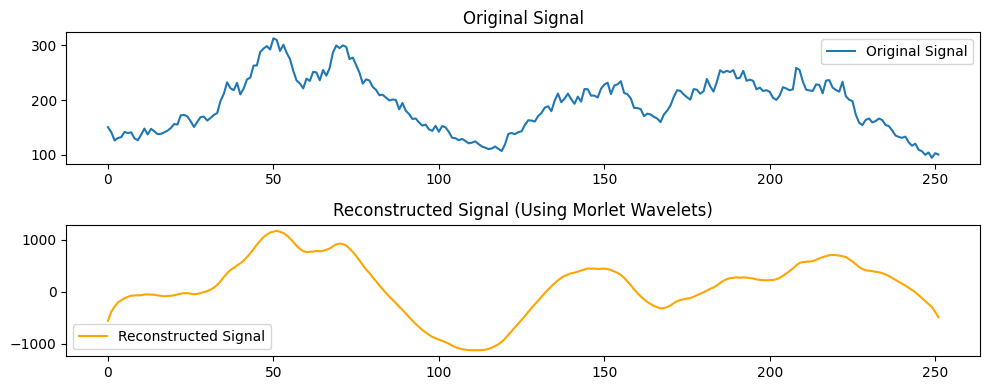
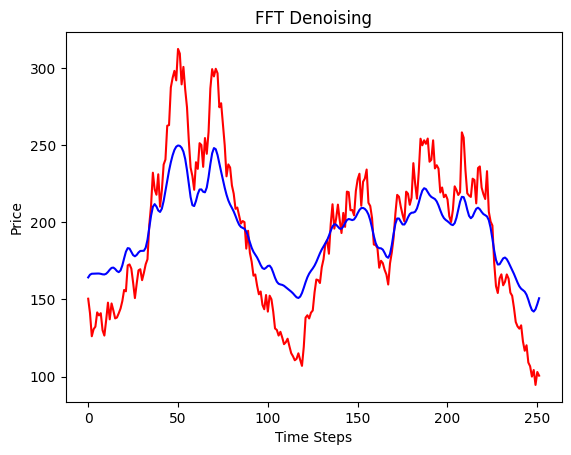
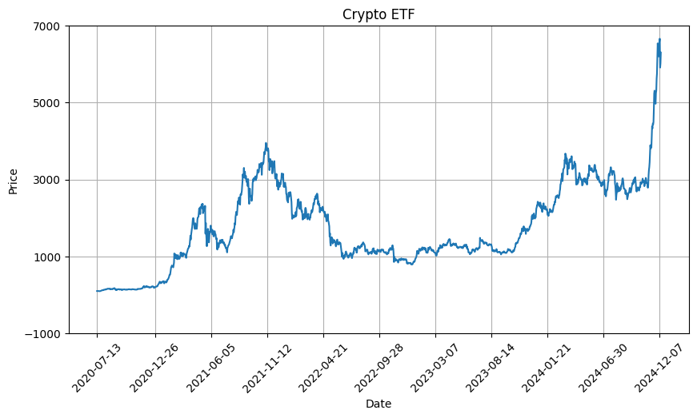

# Mining Data with Morlet Wavelets - Historical Crypto Cycle Analysis



---
Using Morlet Wavelets we are able to capture both frequency and time. We can then reconstruct the curve to uncover any mid-long term trends we were looking for. This method is fairly effective at producing a pure denoised signal, but more research has to be done as to why the y-axis is scaled so disproportionately. 

---


---

One disadvantage of using an Fast Fourier Transform is that it only takes frequency into consideration and not time, thus it is more difficult to rebuild an accurate denoised signal. Further, the FFT assumes stationarity, thus Morlet Wavelets are more robust then the common FFT.

---

# Crypto ETF 



| Metric              | Crypto ETF Value |
|---------------------|------------------|
| Annualized Return   | 0.916497         |
| Volatility          | 0.652803         |
| Sharpe Ratio        | 1.373304         |
| Sortino Ratio       | 1.896141         |
| Max Drawdown        | -0.800194        |
| Alpha               | 0.647176         |
| Beta                | 1.608164         |

---

The following formulas form the foundation for calculating and managing an equal-weighted ETF. The cryptocurrencies that make up the ETF are as follows: Bitcoin, BNB, Cardano, Ethereum, Solana, XRP.

---

## 1. Initial Shares Calculation
The number of initial shares to hold for each asset is calculated as:
```math
\text{Initial Shares (per asset)} = \frac{\text{Initial Investment} \times \text{Weight (per asset)}}{\text{Asset Price at Initial Time}}
```

---

## 2. Index Level Calculation
The index level at any time \( t \) is calculated as:
```math
\text{Index Price} = \left( \frac{\text{Total Value of Investments at Time } t}{\text{Initial Total Value}} \right) \times \text{Base Value}
```
Where:
- **Total Value** is the sum of the current value of each asset's investment.
- **Base Value** sets the initial index value (e.g., 100).

---

## 3. Rebalancing Logic
During rebalancing, the following formulas are used:

### Target Investment (per asset):
```math
\text{Target Investment (per asset)} = \text{Total Investment} \times \text{Weight (per asset)}
```

### Transaction Fees:
```math
\text{Transaction Fees} = \text{Delta Shares} \times \text{Price (per share)} \times \text{Transaction Fee Rate}
```

### Delta Shares:
```math
\text{Delta Shares} = \left| \frac{\text{Target Investment (per asset)}}{\text{Current Price (per share)}} - \text{Initial Shares (per asset)} \right|
```

---

## 4. Adjusting Shares After Rebalancing
After rebalancing, the new shares for each asset are calculated as:
```math
\text{New Shares (per asset)} = \frac{\text{Adjusted Target Investment (per asset)}}{\text{Price (per share)}}
```


